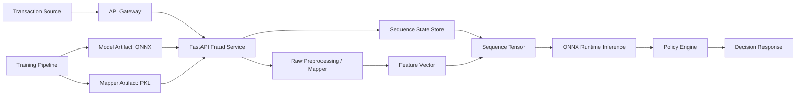
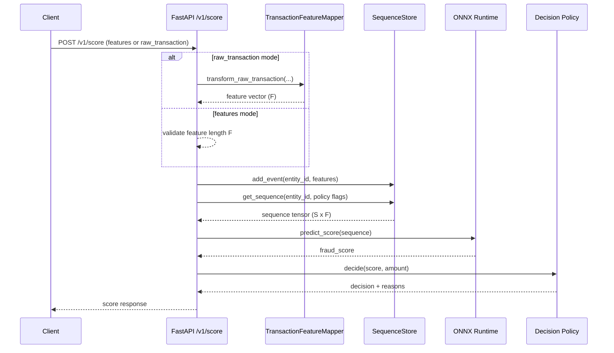
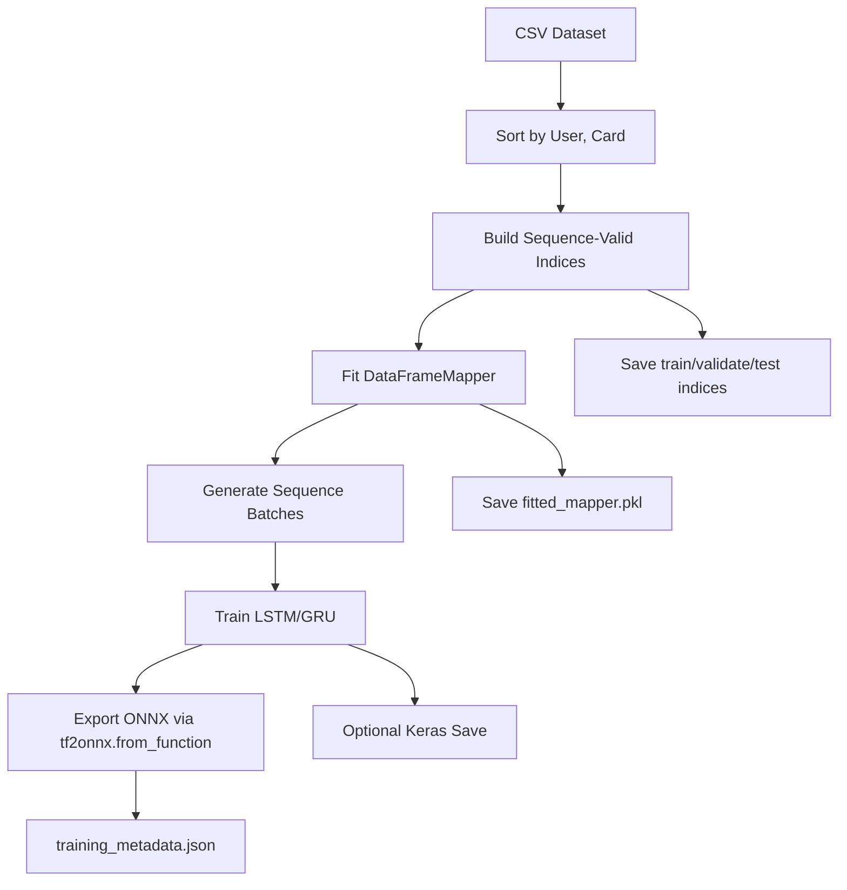

# Anomaly Detection System (FastAPI + ONNX)

This repository implements an end-to-end Anomaly detection stack with:
- reference notebook-aligned feature engineering and sequence modeling patterns.
- ONNX model export and low-latency inference via ONNX Runtime.
- FastAPI microservice for online scoring.
- Training pipeline for LSTM/GRU sequence models.

Primary use case: real-time fraud risk scoring for card transactions with sequence-aware behavioral context.

---

## Table of Contents
- [1. System Overview](#1-system-overview)
- [2. High-Level Architecture](#2-high-level-architecture)
- [3. Low-Level Architecture](#3-low-level-architecture)
- [4. Data and Feature Pipeline](#4-data-and-feature-pipeline)
- [5. Model and Training Design](#5-model-and-training-design)
- [6. Inference API Design](#6-inference-api-design)
- [7. Repository Structure](#7-repository-structure)
- [8. Setup](#8-setup)
- [9. Train and Export ONNX](#9-train-and-export-onnx)
- [10. Run Inference](#10-run-inference)
- [11. Troubleshooting](#11-troubleshooting)
- [12. Production Hardening Roadmap](#12-production-hardening-roadmap)

---

## 1. System Overview

### Problem
Fraud signals are temporal. A transaction should be scored not only on its current attributes but also on recent behavior of the same entity (card/account/device).

### Core Technical Approach
1. Convert raw transaction fields into model features using mapper-based preprocessing.
2. Build an entity-specific sequence window (`seq_len=7` by default).
3. Run ONNX model inference.
4. Apply threshold policy to return action (`APPROVE`, `REVIEW`, `CHALLENGE`, `DECLINE`).

### Current Implementation Highlights
- FastAPI service with readiness/liveness endpoints.
- ONNX input layout auto-detection (`time_major` vs `batch_major`).
- Dual input mode:
  - direct feature vector (`features`)
  - raw transaction (`raw_transaction`) mapped online with fitted mapper.
- ONNX export integrated into training script.

---

## 2. High-Level Architecture

### 2.1 Component View


### 2.2 Data Flow (Online)
1. Request hits `POST /v1/score`.
2. Input is validated via `pydantic` schemas.
3. Either:
   - use provided `features`, or
   - map `raw_transaction -> feature vector` via fitted mapper.
4. Sequence state is updated for `entity_id`.
5. Sequence tensor is formed and passed to ONNX model.
6. Score is translated to decision using policy thresholds.
7. Response returns score, decision, reasons, model version, and latency.

### 2.3 Control and Reliability
- Startup loads model and mapper.
- `GET /health/ready` returns `503` if model is not initialized.
- Runtime shape checks prevent silent model contract drift.

---

## 3. Low-Level Architecture

### 3.1 Inference Service Internals

#### `app/main.py`
- Service bootstrap and endpoint wiring.
- Startup:
  - initializes `FraudModel` from `MODEL_PATH`.
  - initializes `SequenceStore` from model signature.
  - loads `TransactionFeatureMapper` from `MAPPER_PATH`.
- Score path:
  - chooses input mode (`features` or `raw_transaction`).
  - updates sequence memory.
  - calls model runtime.
  - applies policy thresholds.

#### `app/model_runtime.py`
- Loads ONNX with `CPUExecutionProvider`.
- Reads input tensor metadata to infer:
  - expected sequence length,
  - expected feature dimension,
  - input layout (`time_major` or `batch_major`),
  - expected batch dimension.
- Builds ONNX input tensor and extracts scalar score from output tensor safely.

#### `app/transaction_preprocessing.py`
- Notebook-compatible encoders (`timeEncoder`, `amtEncoder`, `decimalEncoder`, `fraudEncoder`).
- Legacy pickle compatibility:
  - registers symbols under `__main__` to resolve old joblib references.
- Runtime normalization:
  - amount formatting,
  - zip handling,
  - missing categorical handling with `np.nan`.

#### `app/sequence_store.py`
- Per-entity in-memory deque with maxlen `seq_len`.
- Supports:
  - strict full-sequence mode,
  - optional left-padding mode.
- Validates incoming feature length against model contract.

#### `app/policy.py`
- Threshold-based decision policy:
  - `APPROVE`, `REVIEW`, `CHALLENGE`, `DECLINE`
- Includes reason trace list for operational explainability.

### 3.2 Training Pipeline Internals

#### `scripts/train_sequence_lstm.py`
- Data preparation:
  - load CSV, sort by `User, Card`.
  - build sequence-valid indices.
- Mapper fitting with notebook-style feature pipeline (`DataFrameMapper`).
- Sequence model training (`lstm` or `gru`).
- ONNX export:
  - uses `tf2onnx.convert.from_function` for Keras 3 compatibility.
- Writes:
  - `fitted_mapper.pkl`
  - `fraud_rnn_static.onnx`
  - optional `.keras` and `.weights.h5`
  - train/val/test indices
  - `training_metadata.json`

### 3.3 Detailed Request Flow Diagram


### 3.4 Detailed Training Flow Diagram


---

## 4. Data and Feature Pipeline

### 4.1 Training Data Source
- Notebook-compatible transaction dataset:
  - `card_transaction.v1.csv`
- dataset lineage reference:
  - `https://github.com/reference-org/TabFormer/tree/main/data/credit_card`

### 4.2 Feature Engineering Logic
Mapper transformations include:
- `Merchant State`: impute -> label encode -> decimal digits -> one-hot
- `Zip`: impute -> decimal digits -> one-hot
- `Merchant Name`: label encode -> decimal digits -> one-hot
- `Merchant City`: label encode -> decimal digits -> one-hot
- `MCC`: label encode -> decimal digits -> one-hot
- `Use Chip`: impute -> label binarizer
- `Errors?`: impute -> label binarizer
- `Year, Month, Day, Time`: timestamp encode -> min-max scale
- `Amount`: log transform -> min-max scale

### 4.3 Feature Dimension Notes
- Dimension is data-dependent (category cardinality dependent).
- Example smoke run produced `input_size = 161`.
- Full corpus can produce larger width (often around `220` in reference-style runs).

---

## 5. Model and Training Design

### 5.1 Model Topology
- Two recurrent layers (`LSTM` or `GRU`) with `return_sequences=True`.
- Dense sigmoid head for per-step fraud probability.
- Input shape: `(batch, seq_len, feature_dim)`.

### 5.2 Training Objective
- Loss: binary cross entropy.
- Optimizer: Adam.
- Metrics: accuracy + TP/FP/FN/TN variants (including last-step metrics).

### 5.3 Sequence Setup
- Default `seq_len=7` (6 historical events + current event convention).
- Sequence sampling is entity-aware after sorting by user/card.

### 5.4 ONNX Export
- Export path integrated in training.
- Hard check enforces ONNX file creation.
- Exported ONNX is the serving artifact consumed by FastAPI.

---

## 6. Inference API Design

### 6.1 Endpoints
- `GET /health/live`
- `GET /health/ready`
- `GET /v1/model/meta`
- `POST /v1/score`

### 6.2 Request Modes
1. `features` mode:
   - caller sends model-ready vector.
2. `raw_transaction` mode:
   - caller sends business fields; mapper expands to model features.

### 6.3 Sequence Policies
Configured via env:
- `REQUIRE_FULL_SEQUENCE`:
  - strict mode; score only after enough history.
- `PAD_SHORT_SEQUENCES`:
  - allow scoring by left-padding zeros.

### 6.4 Decision Policy
Thresholds:
- `APPROVE_THRESHOLD`
- `CHALLENGE_THRESHOLD`
- `DECLINE_THRESHOLD`

Returned response contains:
- `fraud_score`
- `decision`
- `reasons`
- `model_version`
- `latency_ms`

---

## 7. Repository Structure

```text
fastapi-fraud/
  app/
    main.py
    model_runtime.py
    transaction_preprocessing.py
    sequence_store.py
    policy.py
    schemas.py
    config.py
  scripts/
    train_sequence_lstm.py
    export_report_docs.py
  artifacts/
    ...
  docs/
    ...
  README.md
  ARCHITECTURE.md
  requirements.txt
  requirements-train.txt
```

---

## 8. Setup

### 8.1 Base Environment
```powershell
python -m venv .venv
.\.venv\Scripts\Activate.ps1
pip install -r requirements.txt
```

### 8.2 Training Dependencies
```powershell
pip install -r requirements-train.txt
```

---

## 9. Train and Export ONNX

### 9.1 Standard Training
```powershell
python scripts\train_sequence_lstm.py `
  --data-path card_transaction.v1.csv `
  --output-dir artifacts\sequence_lstm_static `
  --model-type lstm `
  --seq-length 7 `
  --batch-size 16 `
  --onnx-batch-size 16 `
  --epochs 3 `
  --steps-per-epoch 500 `
  --evaluate
```

### 9.2 Fast Smoke Training with ONNX Output
```powershell
python scripts\train_sequence_lstm.py `
  --data-path artifacts\smoke_data\card_transaction_5k_stratified.csv `
  --output-dir artifacts\sequence_lstm_smoke_onnx_verify2 `
  --model-type lstm `
  --seq-length 7 `
  --batch-size 8 `
  --onnx-batch-size 8 `
  --epochs 1 `
  --steps-per-epoch 1 `
  --unit-1 32 `
  --unit-2 32 `
  --skip-keras-save
```

Expected key artifacts:
- `fitted_mapper.pkl`
- `fraud_rnn_static.onnx`
- `training_metadata.json`

---

## 10. Run Inference

### 10.1 Start API
```powershell
$env:MODEL_PATH="artifacts/sequence_lstm_smoke_onnx_verify2/fraud_rnn_static.onnx"
$env:MAPPER_PATH="artifacts/sequence_lstm_smoke_onnx_verify2/fitted_mapper.pkl"
$env:MODEL_VERSION="smoke-onnx-v1"
$env:REQUIRE_FULL_SEQUENCE="false"
$env:PAD_SHORT_SEQUENCES="true"

uvicorn app.main:app --host 0.0.0.0 --port 8000
```

### 10.2 Quick Health Checks
```powershell
Invoke-RestMethod http://localhost:8000/health/live
Invoke-RestMethod http://localhost:8000/health/ready
Invoke-RestMethod http://localhost:8000/v1/model/meta
```

### 10.3 Scoring Call
Use either:
- raw payload using known training categories, or
- direct `features` payload with exact dimension from `/v1/model/meta`.

---

## 11. Troubleshooting

### `AttributeError` when loading mapper (`__main__.fraud_encoder`)
Cause: legacy pickle symbol resolution.  
Status: handled in `app/transaction_preprocessing.py` by runtime symbol registration.

### `422` unseen labels (for example merchant name)
Cause: mapper learned categories from training set; unseen category at inference.  
Resolution:
- test with values that exist in mapper training data, or
- move to unknown-safe categorical encoding strategy in future pipeline.

### Feature dimension mismatch
Cause: ONNX expects feature width different from mapper output.  
Resolution:
- ensure model and mapper come from same training run.
- check `/v1/model/meta`.

### Sequence too short
Cause: strict sequence mode with insufficient history.  
Resolution:
- set `REQUIRE_FULL_SEQUENCE=false` and `PAD_SHORT_SEQUENCES=true` for testing.

---

## 12. Production Hardening Roadmap

1. Replace in-memory sequence store with Redis/Aerospike.
2. Replace brittle label encoding with OOV-safe encoding.
3. Add model registry and versioned deployment pipeline.
4. Add observability:
   - request tracing,
   - latency SLOs,
   - drift monitoring.
5. Add resilient fallback policy when model/mapper unavailable.
6. Add authN/authZ, mTLS, and secrets management.
7. Introduce canary and rollback deployment controls.

---

## References
- upstream fraud detection repository: `https://github.com/reference-org/ai-on-z-fraud-detection`
- dataset lineage: `https://github.com/reference-org/TabFormer/tree/main/data/credit_card`

